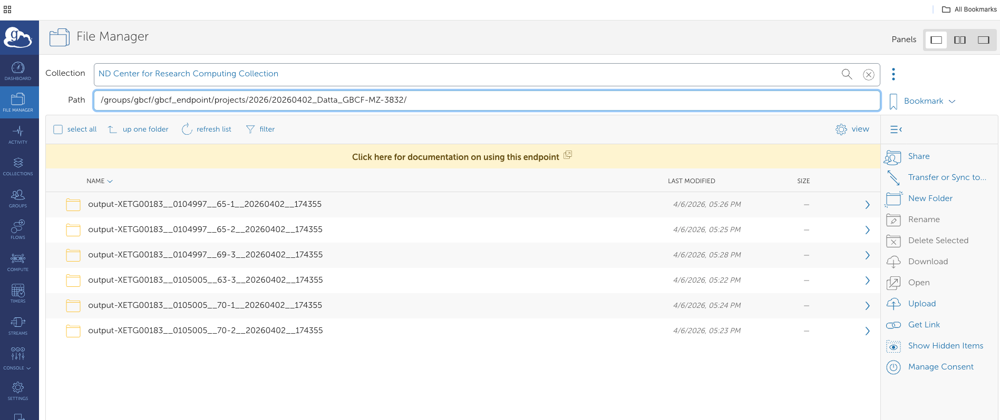
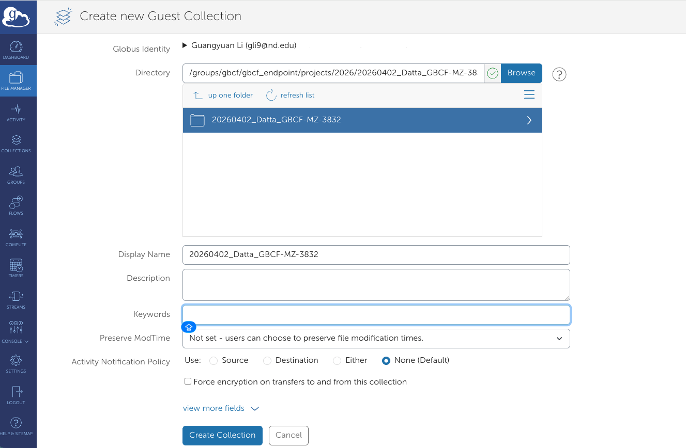
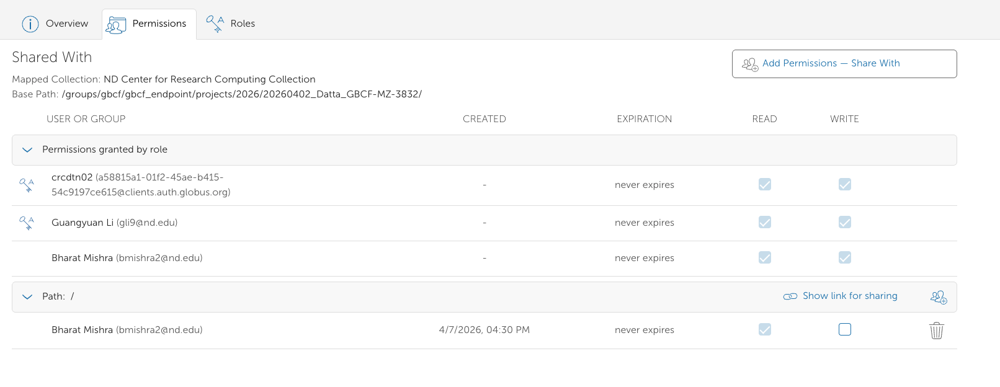
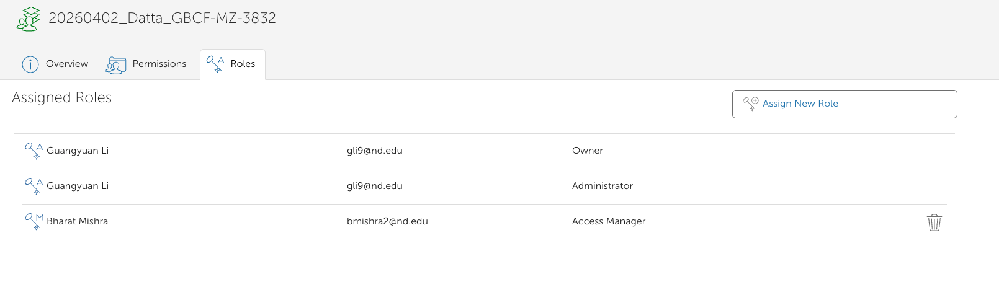

# fastq_quality_check

Quality control workflow for NGS FASTQ files using FastQC and MultiQC. This workflow automates the transfer, quality assessment, and reporting of sequencing data.

## Overview

This workflow consists of four main scripts that handle NGS data quality control:

1. **File Transfer** - Moves FASTQ files from secondary clusters to centralized storage
2. **FastQC Analysis** - Runs quality control analysis on individual FASTQ files
3. **MultiQC Reporting** - Generates aggregated quality reports across all samples
4. **Access Control** - Manages user permissions and data security

## Scripts

### 01_file_transfer.sh
Transfers FASTQ files from the secondary cluster (lightsheetfs) to AFS storage and performs MD5 checksum validation.

**Configuration:**
- Update `your_username` with your CRC username
- Set `sequence_folder` to the source folder name
- Set `storage_location` to the destination folder (e.g., "May2025")
- Specify `renamed_folder` if renaming is needed

**Features:**
- Secure SSH tunnel to remote clusters
- Background copy operations for efficiency
- Folder renaming capability
- MD5 checksum generation for data integrity verification

### 02_fastqc.sh
Runs FastQC quality control analysis and consolidates summary reports.

**Configuration:**
- `input_dir` - Directory containing FASTQ files
- `results_base_dir` - Base directory for analysis output
- `fastqc_output_subdir` - Subdirectory for FastQC results (default: "fastqc_untrimmed_reads")
- `docs_dir` - Directory for consolidated summaries

**Features:**
- Automatic directory creation
- Unzips FastQC reports
- Consolidates all summary.txt files into a single report
- Error handling for missing directories

### 03_multiqc_PreTrim.sh
Generates MultiQC aggregated reports from FastQC output.

**Configuration:**
- `input_dir` - Directory containing FastQC output to analyze
- `results_base_dir` - Base directory for MultiQC output
- `multiqc_output_subdir` - Subdirectory for reports (default: "multiqc_report_PreTrim")
- `multiqc_report_name` - Output HTML report name

**Features:**
- Searches input directory recursively for compatible log files
- Generates interactive HTML reports
- Automatic error handling and validation

### 04_set_ACL.sh
Manages access permissions for sequence data folders.

**Configuration:**
- `your_username` - Your CRC username
- `client_username` - Username to grant access
- `sequence_folder` - Target folder for permission changes

**Features:**
- Adds users to access control groups
- Sets directory-level access permissions
- Lists current ACLs for verification
- Supports multiple storage locations

## Prerequisites

- Access to CRC (Notre Dame Center for Research Computing) clusters
- FastQC installed (or `module load bio/2.0` available)
- MultiQC installed
- AFS client access for secure file transfer
- SSH keys configured for cluster authentication

## Usage

1. **Configure each script** with your specific paths and usernames
2. **Run in sequence:**
   ```bash
   ./01_file_transfer.sh
   ./02_fastqc.sh
   ./03_multiqc_PreTrim.sh
   ./04_set_acl.sh
   ```
3. **Monitor progress** - Each script provides status updates
4. **Review results** - Open MultiQC HTML reports in a web browser

## Output Structure

```
results_base_dir/
├── fastqc_untrimmed_reads/
│   ├── sample1_fastqc.html
│   ├── sample2_fastqc.html
│   └── ...
└── multiqc_report_PreTrim/
    └── multiqc_report_PreTrim.html
```


## Creating Globus Collection to share
Globus provides another means to conveniently transfer the data within ND or with external collaborator. Since Notre Dame CRC has its own registered Globus collection, this process is fairly easy. First, login [Globus](https://www.globus.org/) using your Notre Dame Credential, Find `ND Center for Research Computing Collection` in `Collection` left side bar. Click this collection, and `Open in File Manager`, within which you can find the folder that you'd like to create a Globus endpoint to share, the path is the same as you would see on CRC. 



Now go back to `ND Center for Research Computing Collection`, click `Collection` top bar and then click `Add Guest Collection` in the top right corner, then create the guest collection.



Once you create the guest collection, it will shows up when you click `Collection` in `ND Center for Research Computing Collection`, you can click the guest collection you created, and give other Globus users' access to the collection by `Permission`.



Finally, give them `Access Manager` role so the client can add other collaborators themselves.




## Notes

- Scripts use SGE (Sun Grid Engine) job submission headers for CRC
- Adjust queue settings (`-q`) based on job requirements
- Review email notifications configured in headers
- Ensure adequate storage space before large transfers
